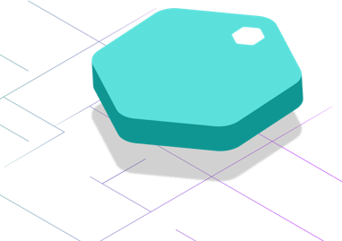
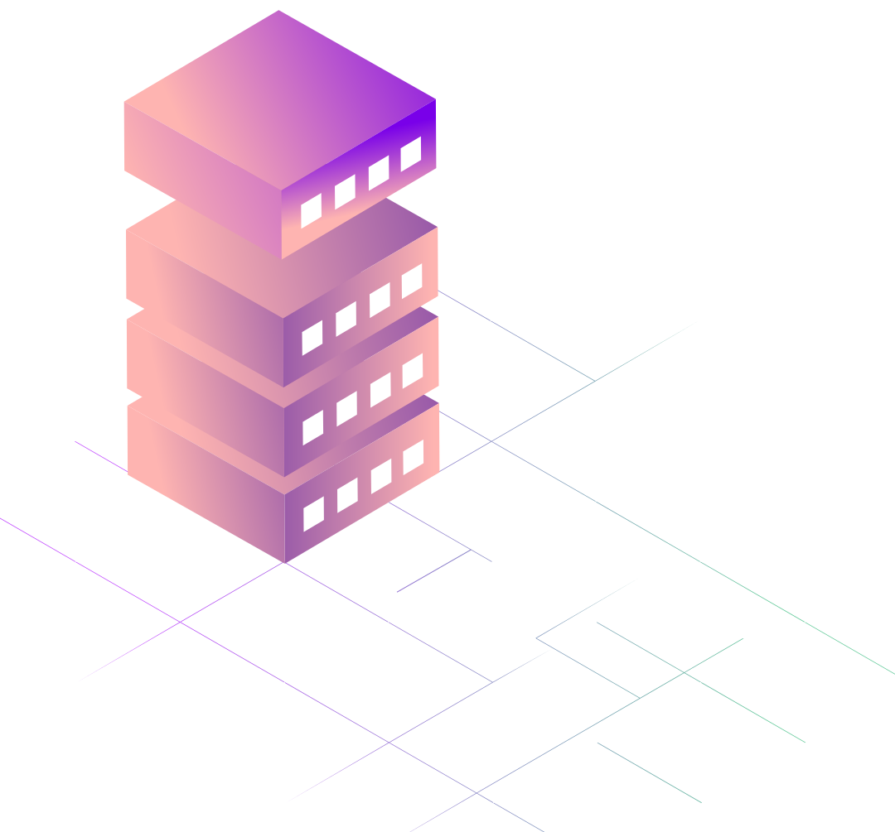
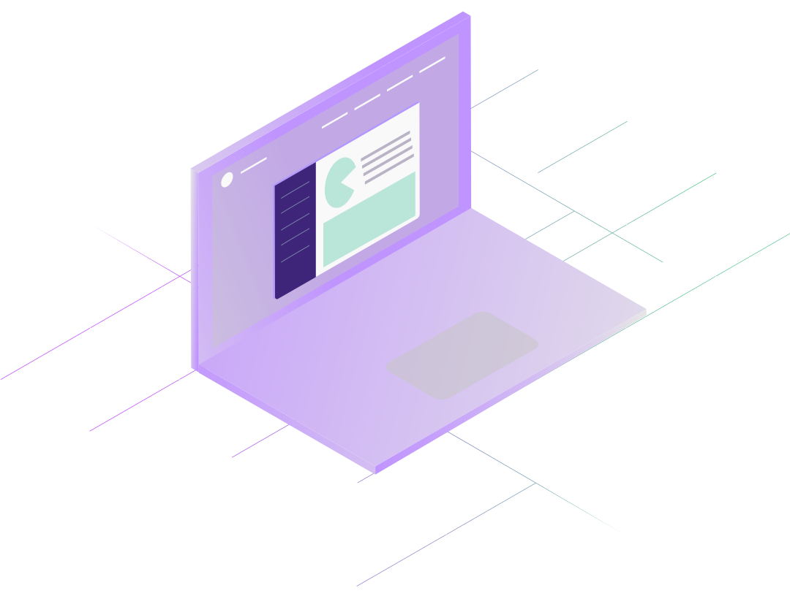
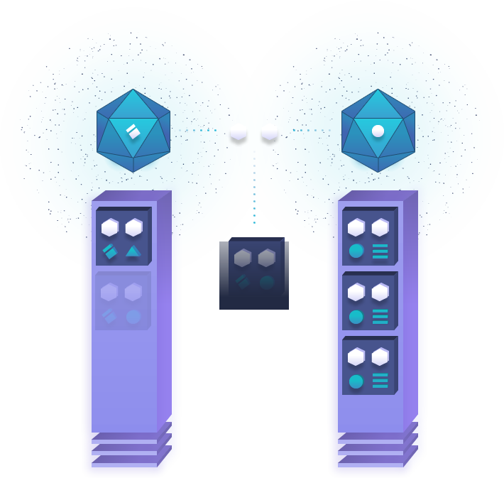
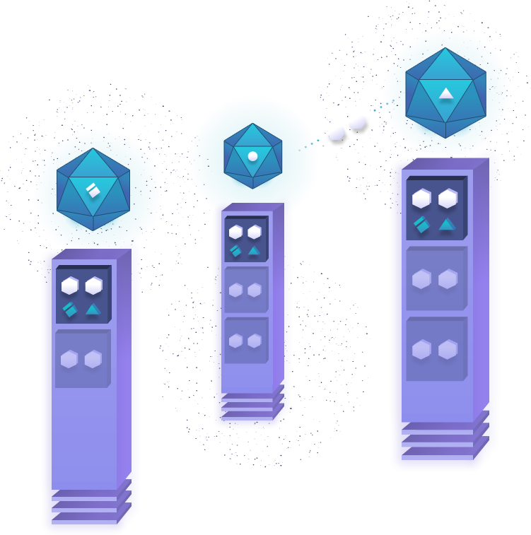

> The XYO Foundation provides this source code available in our efforts to advance the understanding of the XYO Procotol and its possible uses. We continue to maintain this software in the interest of developer education. Usage of this source code is not intended for production. 

  Difficulty Level: Easy

## Sentinels

Sentinels are the first heuristic witness on the XYO origin chain. They observe heuristics and confirm certainty and accuracy of the heuristic. They produce ledgers that Diviners can be certain came from the same source by adding **Proof of Origin** to them.

#### Devices
- Sentinel-X

## Bridges

Bridges are heuristic transcribers. They relay heuristic ledgers from Sentinels to Diviners and add **Proof of Origin** to that relay. The bridge needs to add a **Proof of Origin** so that the diviner can confirm that the bridge has not been altered in any way. The relay ends up collected by the Archivist.

#### Devices
- Bridge X
- Android or iOS Smartphone

## Archivists

Archivist components store heuristics in a decentralized form with the goal of having all historical ledgers stored, but without that requirement. If some data gets lost or becomes temporarily unavailable, the system continues to function with reduced accuracy. Archivists also index ledgers so that they can return a string of ledger data if needed. Archivists store raw data only and get paid only for retrieval of the data. 

#### Devices
- Smart Device
- Computer 

## Diviners

A Diviner answers a given question by analyzing historical data that has been stored by XYO. To accomplish this, heuristics stored in XYO must have a high level of **Proof of Origin**. XYO is a trustless system, so Diviners must be incentivized to produce honest analysis of heuristics. Diviners currently use proof of work to add answers, but will soon go to a proof of stake. 

#### Devices
- Smart Device
- Computer

## Proof Of Origin

In a trustless system, data may be lost, damaged, tampered with, or otherwise corrupted. Traditional Proof of Origin in a trustless system relies on a private key for signing transactions or contracts in a system. This works very well with the assumption that the node on the network that signs the data in question is physically and virtually secure. If the private key is compromised, then the ability to prove origin falters. **Proof of Origin** is the key to verifying that ledgers flowing into XYO are valid. A unique ID for source of data is not practical since it can be spoofed, private key signing is not practical since most parts of XYO are difficult or impossible to physically secure, so the ability for a bad actor to steal a private key is too feasible. XYO solves this by using **transient key chaining**. The benefit of this is the impossibility to falsify the chain of origin for data. 

## Bound Witness

In a trustless system, a witness node can either (through defect or corruption) produce false data. Invalid data can be detected and removed simply if it falls outside the allowed range for that heuristic. Valid but incorrect data (i.e. false data) is much more difficult to detect. Given that an untrusted source of data used to resolve a digital contract (an oracle) is not useful, we can substantially increase the certainty of the data provided by first establishing the existence of a **bidirectional proof of location**. The primary bidirectional location heuristic is proximity, since both parties can validate the occurrence and range of an interaction by cosigning the interaction. This allows for a zero-knowledge proof that the two nodes were in proximity of each other. This novel concept is called **Bound Witness**, and XYO introduces this possibility, for the first time ever, to the world. The implications of this will change a multitude of industries and the way we trade in the world.

