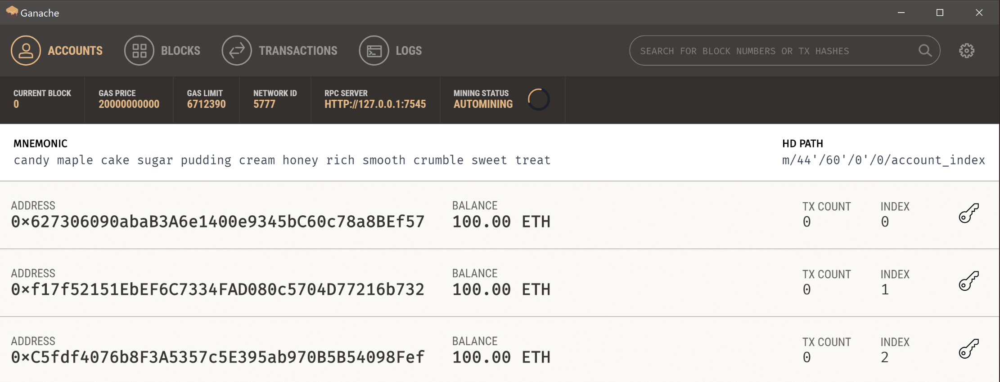

## We are excited to be part of ETHDenver

**We are even more excited to meet you all as you look to work with XYO and our suite of products**

**For ETHDenver we are hosting three $500 bounties for the best User Interface, best EVM Package for XYO Smart Contracts, or a thorough security review.**

## A few things to consider

- It would be wise before you start to develop your contracts in a local environment. We have some [resources]() for you to get started.
- Don't rush to code, you have some time to think this problem through. In fact, it's far more effective to fully understand the challenge and whiteboarding/brainstorming through the problem before writing `pragma solidity...`
- Have fun and ask questions!

### Pre-requisites
- [Web3](https://web3js.readthedocs.io/en/1.0/) working knowledge
- Use <a href="https://developers.xyo.network/docs/en/dapper/" target="_blank"><strong>dApper</strong></a> - required
- Use <a href="https://developers.xyo.network/docs/en/dapploy/" target="_blank"><strong>dApploy</strong></a> - required
- Use the kovan-testnet. If you need KEth for the testnet, **[click on this link](https://github.com/kovan-testnet/faucet)**
- React skills
- We recommend following our style guide

## The Challenges

### Build a User Interface (choose one)

**Since you are building an interface, think about the end user experience in your approach.**

1. **Onboard a Diviner** - how can we get an XYO Diviner responding to questions on a testnet away from local development? It would be helpful to follow the [Payable on Delivery Demo](https://developers.xyo.network/docs/en/payable-demo/) Prior to figuring out an onboarding process.

2. **Stake/unstake/withdraw/activate a Diviner** - In order for any component on XYO to participate, especially the Diviner, needs to put a stake in (Proof of Stake) to legitimize their responses on-chain. How would you approach this? 

3. **Governance** - In order for fair rewards upon successful completion of an question/response session, we need to provide rewards from the stake pool. Write and implement a smart contract for voting on re-parameterization of XYO and one time actions. 

4. **Withdraw rewards** - Write and implement a smart contract that can ask for a widthdraw from a 'master wallet' which holds the totals of successful question/response sessions. Do this without any reentrancy and ensure that the contract is secure and modular, and implements or knows about consensus.

5. **Submit Requests {Payable On Delivery}** - Create the UI for a [Payable On Delivery](https://developers.xyo.network/docs/en/payable-demo/) contract and send metatransactions to a relayer that would cover gas and modify contract to accept relayer callbacks.

## Preparing Your Build Environment 

**Note** For any of these challenges you will need to access our Simple Consensus Smart Contract Dapp Library (SCSC) <a href="https://github.com/XYOracleNetwork/dapp-scsc-solidity/tree/master" target="_blank">here</a> and have the kovan testnet ready

**Build your environment to be ready to test your solutions:**

**XYO SCSC Repository**
-- **Smart Contracts available:**

- XyPayOnDelivery
- XyStakingModel
- XyStakingConsensus
- XyStakableToken
- XyGovernance
- XyNodeMapping
- PLCR Voting

</br>

### Start up Ganache

**Ganache**

First **[download Ganache](https://truffleframework.com/ganache)**

Then install and open a UI instance which should look like the image below

**Take note of the mnemonic, you will need this for metamask interaction**

<h1 align="left">
  
</h1>



</br>

### Get some keth

In order to interact with Kovan, it would be good to get some ETH on it. [Use this kovan-testnet faucet](https://github.com/kovan-testnet/faucet) and copy the first account address from your Ganache. You'll also need to allow access to your GitHub. 

**Give the faucet a moment to send the keth to your account**


### Start up metamask
**Metamask** - pointing to **Kovan Testnet**
<h1 align="left">
  
</h1>

Now we can start up Metamask, you can [download the chrome or firefox extension here](https://metamask.io/)

Once you do, you will be prompted to login with a password or restore account from a seed phrase. That seed phrase will be the mnemonic from your ganache
<h1 align="center">
  
</h1>

Click on the **import using account seed phrase**

You will be redirected to a new tab where you will have to click the **import seed phrase button again**

Then you will enter the mnemonic in the wallet seed window and create your own password to access the accounts

<h1 align="center">
  
</h1>

Once you do that, you will see your eth on metamask. You will only have one eth on the Kovan testnet. If you want to see your local ganache balance, you can click on the dropdown where **Kovan Test Network** is listed and change that to **Localhost 8545** and see your Ganache generated 100eth. 


</br>

## Build Your Smart Contracts

**Now you have the currency needed to run the smart contracts to help build your interfaces!**

**XYO Toolset**

### Using dApploy

<h1 align="left">
  
</h1>

**Clone the SCSC Repository**
```bash
git clone https://github.com/XYOracleNetwork/dapp-scsc-solidity.git
```

**Add dApploy**
```bash
yarn global add tool-dapploy-nodejs
```
**Install dependencies**
```bash
yarn install 
```
**Alternative to using the Ganache UI, you can use this command to get some accounts and a mnemonic, this also allows you to see transactions in the terminal**
```bash
yarn chain
```

**Compile, Build, and Deploy the contracts**
```bash
dapploy
```

**To deploy on the Kovan testnet set up an .env file with these fields: `WALLET`, `INFURA_API_KEY`, and `MNEMONIC`**
- To get an `INFURA_API_KEY` go to [infura.io](infura.io) and create a project. 

**Compile, Build, and Deploy the contracts on Kovan**
```bash
dapploy -n kovan
```

## Adding files to IPFS

You have the option to add these contracts to ipfs either with a command on the terminal or using dApper

### Using the terminal 
```bash
ipfs add -r build/contracts
```
**Note** You may need to run `ipfs init` before the above command, in which case you may have to run this on your own ipfs daemon

In which case, you would use the command 
```bash
ipfs daemon
```

The other way **before interacting with dApper** would be to run this command 
```bash
dapploy -p
```

### Using dApper

<h1 align="left">
  
</h1>

To see how dApper works [check it out here](dapper.layerone.co) 

<h1 align="center">
  
</h1>

- **First thing you want to do is connect your wallet(which will prompt metamask for transaction approval)**

- **Add your ipfs hash directly into the `add abi` field. Be sure to select Kovan**

<h1 align="center">
  
</h1>

- **You should now be able to access your interface in dApper for testing**


### Submitting your User Interface

**NOTE** Choose a team member to submit the project that has Metamask on the Rinkeby testnet

Visit the [ETHDenver Submission Link](https://kauri.io/login?r=/write-article/ethdenver&redirected=true)

<h1 align="center">
  
</h1>

Once you click on submit, you will be directed to an information form about your project. 

<h1 align="center">
  
</h1>

Here you will enter this information about your project:

- Project Tagline
- Team members 
- Status.im ID for Each Team Member 
- Detailed Project Description
- Describe your tech stack (hopefully you have implemented a few of our tools)
- Track for which you are submitting (open should be fine, but check in with your team)
- All Bounties Completed/Incorporated (XYO for this project)
- A link to all of your source code on a public repo

**Note that this is all in a text editor**

**Important!!** Make sure you add the tag **BOUNTY-XYO-2019**

<h1 align="center">
  
</h1>

**Publish article to submit your project**

<h1 align="center">
  
</h1>

## CONGRATS! YOU JUST SUBMITTED YOUR USER INTERFACE!

## Create an EVM Package using ZeppelinOS 

**ZeppelinOS is ready to go, and we are excited to present another way to win their $1000 bounty and our $500 bounty. 

**Challenge**

Currently we have three upgradeable contracts: Parameterizer, Governance and PLCR. Which you can see in our [SCSC Library](https://github.com/XYOracleNetwork/dapp-scsc-solidity/tree/master). 

- Create an EVM Package using ZeppelinOS that deploy the suite of XYO smart contracts
- All contracts need to be interfaceable and upgradeable
- Add the proxies to the upgradeable contracts for all SCSC contracts

#### Pre-requisites
- [ZeppelinOS](https://docs.zeppelinos.org/docs/start.html)
- [SCSC dApp library](https://github.com/XYOracleNetwork/dapp-scsc-solidity/tree/master)
- Read the 3 part series on EVM Package Deployment
<h1 align="left">
  
</h1>
  - [Part one](https://blog.zeppelinos.org/evm-package-deployment-with-zeppelinos-part-i-introduction-and-creating-a-linkedlist-contract/)
  - [Part two](https://blog.zeppelinos.org/evm-package-deployment-with-zeppelinos-part-ii-deploying-and-testing-a-linkedlist-contract/)
  - [Part three](https://blog.zeppelinos.org/evm-package-deployment-with-zeppelinos-part-iii-linking-to-mainnet/)

### Submitting Your EVM Package

**NOTE** Choose a team member to submit the project that has Metamask on the Rinkeby testnet

Visit the [ETHDenver Submission Link](https://kauri.io/login?r=/write-article/ethdenver&redirected=true)

<h1 align="center">
  
</h1>

Once you click on submit, you will be directed to an information form about your project. 

<h1 align="center">
  
</h1>

Here you will enter this information about your project:

- Project Tagline
- Team members 
- Status.im ID for Each Team Member 
- Detailed Project Description
- Describe your tech stack (hopefully you have implemented a few of our tools)
- Track for which you are submitting (open should be fine, but check in with your team)
- All Bounties Completed/Incorporated (XYO for this project)
- A link to all of your source code on a public repo

**Note that this is all in a text editor**

**Important!!** Make sure you add the tags **BOUNTY-XYO-2019** and **BOUNTY_ZEPPELIN_2019**

<h1 align="center">
  
</h1>

<h1 align="center">
  
</h1>

**Publish article to submit your project**

<h1 align="center">
  
</h1>

## CONGRATS! YOU JUST SUBMITTED YOUR EVM PACKAGE!

## Security Review  

#### Pour through our smart contracts and conduct a thorough security review

**Challenges**

## 1. Create **echidna** fuzz tests with assertions.

### Tools to use for this project 

<h1 align="left">
  
</h1>

**echinda**
</br>
Echidna is a Haskell library designed for fuzzing/property-based testing of EVM code.
</br>
</br>
**[Read the docs here](https://github.com/trailofbits/echidna)**
</br>
**We recommend that you take the time to look into the docs to help you or your team create contracts with tests**
</br>
**There is an example contract with tests in the repo**
</br>
</br>
The challenge in working with this library is the API to build custom fuzzing systems. Consider the following when considering using this tool: 
- There are many configuration options
- The API changes quickly and is poorly documented
</br>
With this in mind, we strongly recommend you use the **[examples directory](https://github.com/trailofbits/echidna/tree/master/examples)** that is provided for you as well as the **[Trail of Bits Blog](https://blog.trailofbits.com/2018/05/03/state-machine-testing-with-echidna/)**

Requirements for use: 
- Working knowledge of Solidity 
- Experience with fuzz testing 
- Working knowledge of Docker

## 2. Unit testing for Governance and Parameterizer

### Truffle test with Mocha/Chai

**Create unit tests for our Governance and Parameterizer contracts.** You can look at the Pay On Delivery Test Contract in our [SCSC Library](https://github.com/XYOracleNetwork/dapp-scsc-solidity/tree/master) as an example. There is also a starting point for the Governance test contract that you could use in your forked repo. 

### Submitting your security review

**NOTE** Choose a team member to submit the project that has Metamask on the Rinkeby testnet

Visit the [ETHDenver Submission Link](https://kauri.io/login?r=/write-article/ethdenver&redirected=true)

<h1 align="center">
  
</h1>

Once you click on submit, you will be directed to an information form about your project. 

<h1 align="center">
  
</h1>

Here you will enter this information about your project:

- Project Tagline
- Team members 
- Status.im ID for Each Team Member 
- Detailed Project Description
- Describe your tech stack (hopefully you have implemented a few of our tools)
- Track for which you are submitting (open should be fine, but check in with your team)
- All Bounties Completed/Incorporated (XYO for this project)
- A link to all of your source code on a public repo

**Note that this is all in a text editor**

**Important!!** Make sure you add the tag **BOUNTY-XYO-2019**

<h1 align="center">
  
</h1>

**Publish article to submit your project**

<h1 align="center">
  
</h1>

**We would also like you to:**

#### Use GitHub
- Fork the [SCSC Library](https://github.com/XYOracleNetwork/dapp-scsc-solidity)
- Create a pull request with
  - The issue 
  - Steps to replicate the issue
  - Proposed solution
- Make sure to commit message on the pull request - **"ETHDenver XYO Security Review"**

## CONGRATS! YOU JUST SUBMITTED YOUR SECURITY REVIEW!